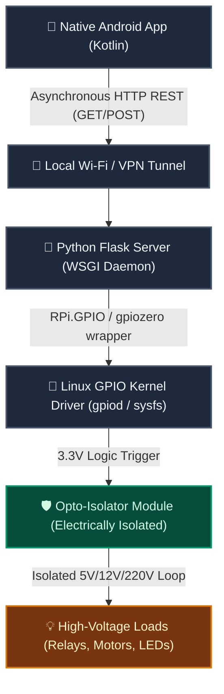

<p align="center">
  
  
  
  
  
  
</p>

<h1 align="center">📡 RPi Wireless Output Control System</h1>

<p align="center">
  <strong>An enterprise-ready, low-latency IoT control ecosystem. Remotely actuate Raspberry Pi GPIO outputs in real time via a native Kotlin Android application over secure Wi-Fi or VPN tunnels.</strong>
</p>

<p align="center">
  
</p>

---

## 📌 Project Overview

This repository showcases a complete **End-to-End IoT (Internet of Things) Control System** bridging mobile application development with physical computing. 

By utilizing a lightweight, REST-based Python server running as a background daemon on the Raspberry Pi, users can toggle relays, transistors, and actuators instantaneously from a mobile interface. This project highlights key concepts in **asynchronous mobile networking**, **hardware-software integration**, **electrical safety**, and **embedded Linux system configuration**.

---

## 🎨 System Architecture Flowchart

The data path flows from user touch events in the mobile UI to physical electron steering on the GPIO pins:



---

## 🌟 Key Features

*   **Real-Time Latency:** High-efficiency HTTP stack ensures sub-100ms response time for local network switching.
*   **Asynchronous Android UI:** Mobile network interactions run inside non-blocking background threads using Kotlin Coroutines, maintaining a fluid 60fps UI.
*   **Hardware Isolation & Safety:** Designed with hardware-level security in mind, utilizing opto-couplers to isolate sensitive 3.3V Pi GPIO headers from high-current inductive loads (relays/motors).
*   **Systemd Daemon Integration:** The Python backend runs as a managed Linux system service, automatically starting on boot, monitoring runtime health, and restarting upon failure.
*   **Dynamic Endpoint Routing:** Clean REST API structure allowing individual pin management (`/api/v1/gpio/<pin_number>/<state>`).

---

## 🛠️ Technology Stack & Tools

| Component | Layer | Technology / Library |
| :--- | :--- | :--- |
| **Android Client** | Frontend | Kotlin, Android SDK, OkHttp3 / Retrofit (Networking), Coroutines |
| **Edge Server** | Backend API | Python 3, Flask / FastAPI, Gunicorn (WSGI Server) |
| **Hardware Control** | Low-Level | `RPi.GPIO` library, Linux Sysfs GPIO controller |
| **System Integration**| Deployment | Systemd Unit files, Bash automation scripting, Linux Firewall (UFW) |
| **Target Platform** | Hardware | Raspberry Pi 3/4/Zero W, 4-Channel Relays with Optocouplers |

---

## ⚡ Developer & Reference Code Snippets

The following code highlights demonstrate the software architecture used to handle clean execution on both the server and mobile side.

### 1. Hardened Python REST Service (Server-Side)
This snippet demonstrates error handling, validation, and safe resource initialization on the Raspberry Pi:

```python
import sys
from flask import Flask, jsonify, make_response
import RPi.GPIO as GPIO

app = Flask(__name__)

# BCM numbering scheme
GPIO.setmode(GPIO.BCM)
CONTROL_PINS = [17, 18, 27]

# Initialize all target pins as Outputs in LOW state on boot
for pin in CONTROL_PINS:
    GPIO.setup(pin, GPIO.OUT)
    GPIO.output(pin, GPIO.LOW)

@app.route('/api/v1/gpio/<int:pin>/<string:state>', methods=['POST', 'GET'])
def toggle_gpio(pin, state):
    if pin not in CONTROL_PINS:
        return make_response(jsonify({"error": f"GPIO pin {pin} is restricted or unavailable"}), 403)
        
    normalized_state = state.lower()
    if normalized_state == "on":
        GPIO.output(pin, GPIO.HIGH)
        return jsonify({"pin": pin, "status": "active", "logic": 1})
    elif normalized_state == "off":
        GPIO.output(pin, GPIO.LOW)
        return jsonify({"pin": pin, "status": "inactive", "logic": 0})
    else:
        return make_response(jsonify({"error": "Invalid state argument. Use 'on' or 'off'"}), 400)

@app.errorhandler(500)
def server_error(e):
    return jsonify({"error": "GPIO controller hardware failure"}), 500

if __name__ == '__main__':
    try:
        app.run(host='0.0.0.0', port=5000)
    finally:
        GPIO.cleanup() # Restore GPIO pins to default input states upon shutdown
```

### 2. Async Network Dispatcher (Android Kotlin Client)
To prevent blocking the Android Main/UI thread, REST queries are dispatched asynchronously:

```kotlin
import kotlinx.coroutines.Dispatchers
import kotlinx.coroutines.withContext
import okhttp3.OkHttpClient
import okhttp3.Request
import java.io.IOException

class GpioClient(private val piIpAddress: String) {
    private val client = OkHttpClient()

    // Dispatches network call on IO Threadpool using Kotlin Coroutines
    suspend fun togglePin(pin: Int, state: String): Result<String> = withContext(Dispatchers.IO) {
        val url = "http://$piIpAddress:5000/api/v1/gpio/$pin/$state"
        val request = Request.Builder().url(url).build()
        
        try {
            client.newCall(request).execute().use { response ->
                if (!response.isSuccessful) {
                    Result.failure(IOException("Unexpected response code: ${response.code}"))
                } else {
                    Result.success(response.body?.string() ?: "")
                }
            }
        } catch (e: Exception) {
            Result.failure(e)
        }
    }
}
```

---

## 🔌 Hardware Safety & Wiring Considerations

When controlling high-voltage AC mains (110V/220V) or large inductive loads (motors), always enforce these hardware design principles:

> [!CAUTION]
> **Flyback Diodes & Isolation:** Inductive loads generate a huge reverse voltage spike (Back EMF) when turned OFF. Always connect a flyback diode across inductive DC loads. For AC loads, ensure you use a **relay module with opto-isolation (optical separation)** to prevent high voltages from feeding back and frying the Raspberry Pi's processor.

---

## 🔒 Security Hardening

For security, avoid exposing the Raspberry Pi server publicly to the open internet. Implement the following strategies:

1.  **VTY Tunneling / VPN:** Install **Tailscale** or **WireGuard** on the Raspberry Pi and client mobile phone. This allows you to securely access your home IoT devices from anywhere in the world without exposing open ports on your router.
2.  **API Tokens:** Implement a simple bearer token in the HTTP header:
    `Authorization: Bearer <your_secure_api_key>`
3.  **Local Network Isolation:** Connect the Pi to a separate IoT-segmented VLAN.

---

## 📬 Contact & Collaboration

The complete deployment-ready code, Kotlin app source files, systemd installation scripts, and Fritzing wiring schematics are available upon request. 

I’m always open to discussing custom firmware builds, system configurations, and automation ideas.

*   📧 **Email:** [mehdimejri15@gmail.com](mailto:mehdimejri15@gmail.com)
*   💼 **GitHub Profile:** [@Mejri-Mehdi](https://github.com/Mejri-Mehdi)
*   🚀 Feel free to open a **GitHub Issue** or contact me directly to collaborate!

---

## 📄 License
This project is open-source and licensed under the **MIT License** - see the [LICENSE](LICENSE) file for details.

<p align="center"><sub>Built with ❤️ and a Raspberry Pi by <a href="https://github.com/Mejri-Mehdi">Mejri Mehdi</a></sub></p>
